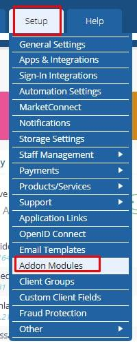
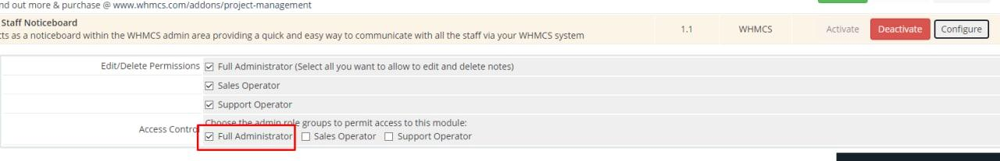

# proxycheckblock-whmcs-plugin

A simple WHMCS hook that checks if the client is using a proxy/VPN.

### Using proxycheckblock

Upload `proxycheckblock` into **WHMCS** `modules/addons` directory.
Next you can active plugins easily in WHMCS panel.

### Active plugin in WHMCS Control Panel

### Related Repository

- https://github.com/proxycheck/proxycheck.io

#### Related Pages

- https://proxycheck.io/
- https://proxycheck.io/examples/
- https://www.whmcs.com/

---------

# Max Base

My nickname is Max, Programming language developer, Full-stack programmer. I love computer scientists, researchers, and compilers.
